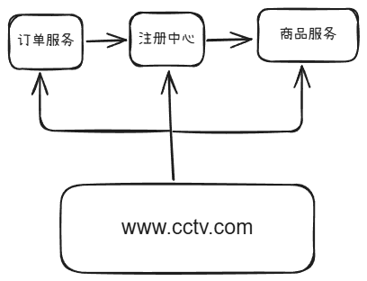
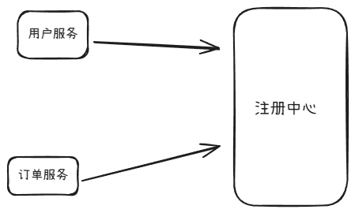

# Spring Cloud 学习笔记

这是我的第一篇Markdown技术笔记，用于记录Spring Cloud的学习过程。

---

## 一、服务注册与发现(Eureka)

Eureka是一个**注册中心**，他的主要作用：

- 微服务启动时向它**注册自己的地址和端口**
- 其他服务可以从它那里**发现目标服务**
- 提供服务健康检查和心跳机制

### 基本原理

在分布式系统中，

调用流程如下：

1. 订单服务
2. 注册中心

---

## 二、负载均衡机制

## 三、服务调用流程

666666

